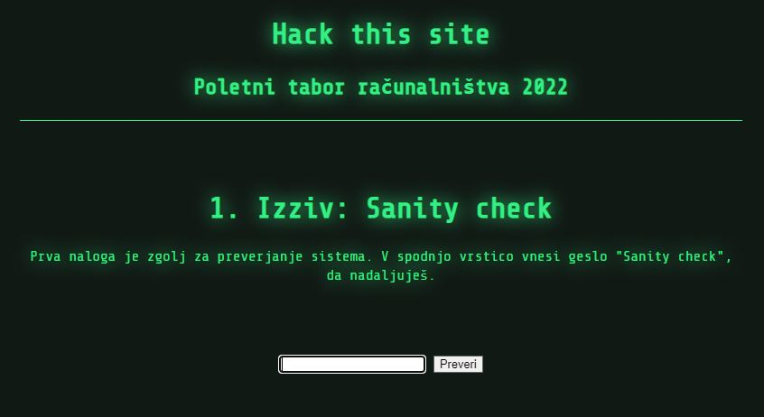
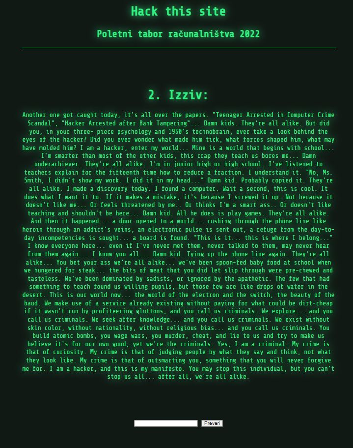
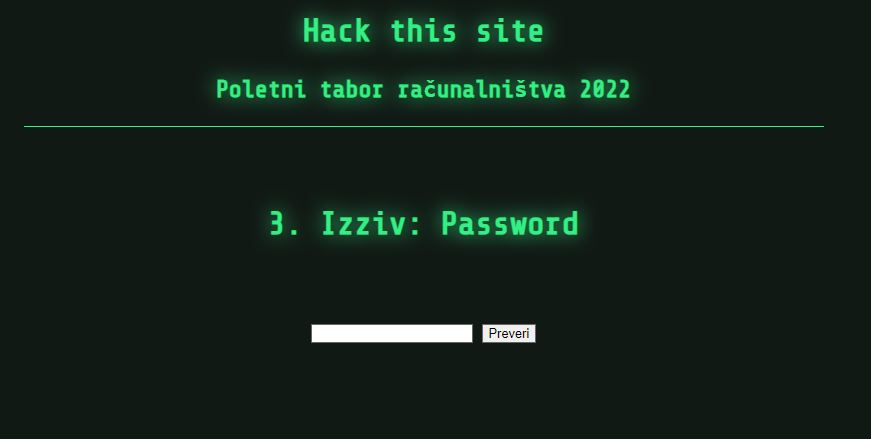
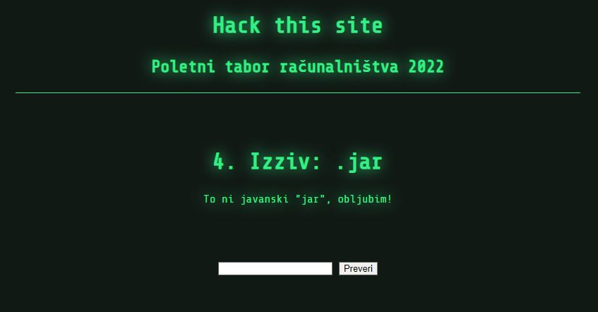
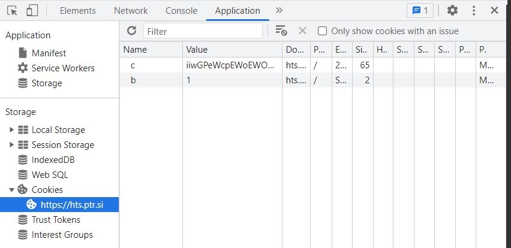
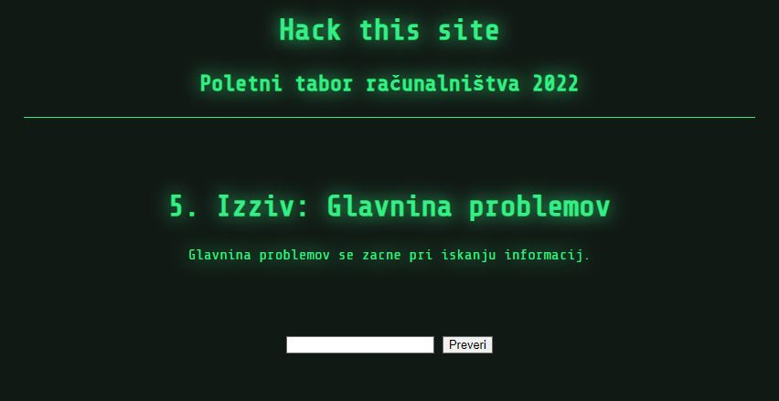
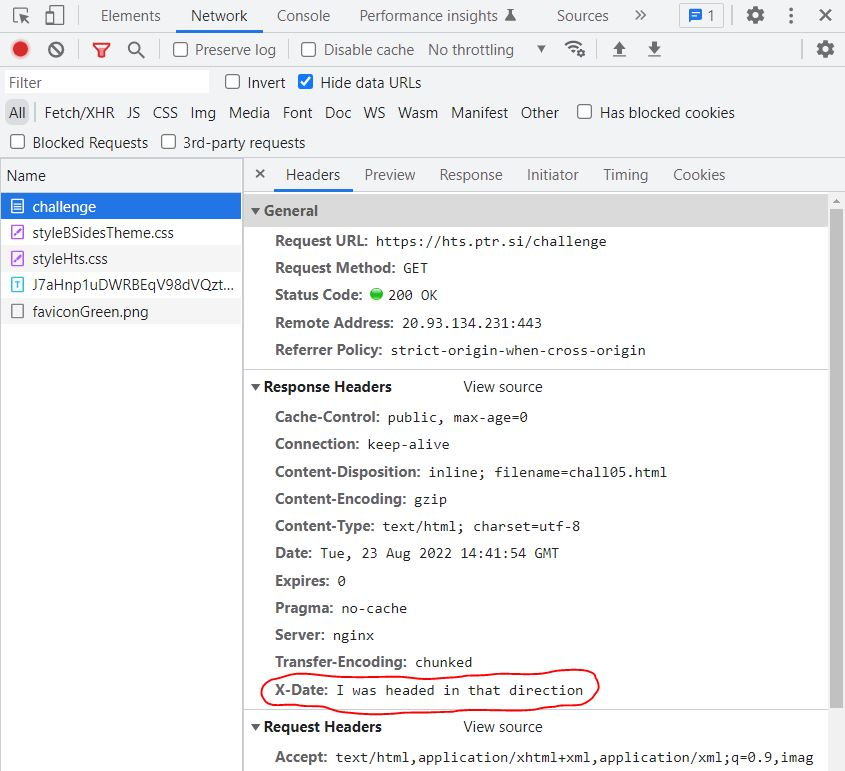
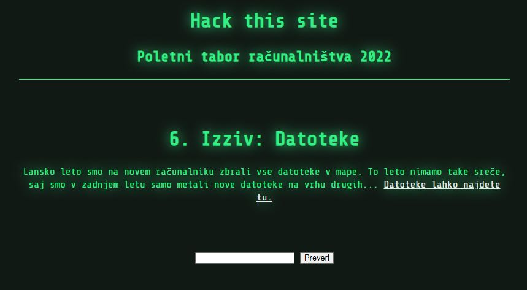

# Hack This Site (HTS) Writeup

Rešitve posameznih izzivov

## PTR 2022 HTS © Andraž Juvan

## 01. Sanity check
<code>c=/</code>
<code>flag=Sanity check</code>

Samo toliko, da preveriš če je stanje tvojega razuma približno v redu: v polje vpišeš "Sanity check", nobenih trikov.

### 02. HTML Comment - Hacker Manifesto
<code>c=jzXFJcsIBLexJoIWupEzeVlYsZuGZREyPbfkxGSsnBXapDmkiXcNSrHmDBVLgnMP</code>
<code>flag="L0r3M 1p5Um"</code>

Flag se skriva v besedilu, zavit v HTML komentar <code>\<!-- --></code>. Najdeš ga v izvorni kodi dokumenta.

### 03. Client side password check

<code>c=BuOLpiLPsojFajcxTzoDDndvKiWqvCbETYlFOfHCLxejUBxFDZSjChBqOMDAcaQs</code>
<code>flag=?</code>

Geslo se preverja izključno na strani klienta (v tvojem brskalniku). Če je vnešeno geslo pravilno, potem Javascript koda pošlje drugačen parameter, kot če ni.

Pri tovrstnem izzivu imamo dve možnosti:
a) Razvozlamo izvorno Javascript kodo (/s/main.js)
- V našem primeru ugotovimo, da je najlažje povoziti funkcijo String.prototype.hashCode (V Console prilepimo kodo: <code>String.prototype.hashCode = function() { return 1867359683; }</code>
- Potem lahko v input okence vpišemo karkoli in bo hashCode ustrezal tistemu s katerim primerjamo.

b) Pošljemo lažen request, kot bi ga sicer koda, če bi bilo geslo pravilno.
V Console prilepimo:

<code>
const xhttp = new XMLHttpRequest();
xhttp.open("POST", "/challenge", true);
xhttp.setRequestHeader('Content-type', 'application/x-www-form-urlencoded');
xhttp.send("flag=ok");
</code>

V obeh primerih v response prejmemo cookie (c). V primeru b) samo še osvežimo stran in že smo na naslednjem izzivu.

### 04. Cookie jar

<code>c=iiwGPeWcpEWoEWOMMDouBziGIrkdQgDDIJaMGdZeYZziTncoIFFZCIcdqffXymwO</code>
<code>flag=?</code>

Izziv namiguje da NE gre za Javanski Java Archive (jar). Za kakšen jar torej gre? Gre morda za vlagalski kozarec (jar) - v kontekstu spletnih tehnologij se rada pojavi asociacija na "Cookie jar", kakor šaljivo imenujemo mesto ali pa datoteko, kjer so shranjeni spletni piškotki.

V razvijalskih orodjih brskalnika preverimo zavihek Application, v sekciji Storage najdemo Cookies. Vidimo piškotke, ki jih brskalnik hrani za to spletno mesto. V našem primeru opazimo nov piškotek z nazivom "b"

S poskušanjem ugotovimo, da sprememba vrednosti piškotka b na karkoli drugega kot 1, omogoči, da nas gumb Preveri na strani ne glede na to, kaj vpišemo v vnosno polje uspešno pripelje na naslednji izziv.

### 05. Header secrets

<code>c=PTYDguBmXwVaMuUXLwKsNqhpwAdYyehAMyZVcHPtjXmvsNKtSEdulkQJMsWcdobW</code>
<code>flag=I was headed in that direction</code>

Izziv posredno namiguje, da se informacije skrivajo v glavi (HTTP zahtevkov). Ne-bodi-ga-leni preverimo kakšen zahtevek pri tem izzivu naš brskalnik pošlje in kakšnega prejme nazaj.

Zagledamo z X- predznačeno polje po meri (ang. custom field). Zavaja s svojim nazivom Date, kljub temu pa hitro opazimo, da njegova vrednost vsebuje besedilo.

### 06. Fuzzer autoindex

<code>c=CFmWKWeUAgDUkAeaVvPoXxzHYUlhMKumZWHKNzpbiHgAtKxjttiolrWhKGkzNpsu</code>
<code>flag=?</code>

### 07. JS obfuscator

### 08. Patcher

### 09. Inversable crypto

### 10. Rev

### 11. Curl file get

